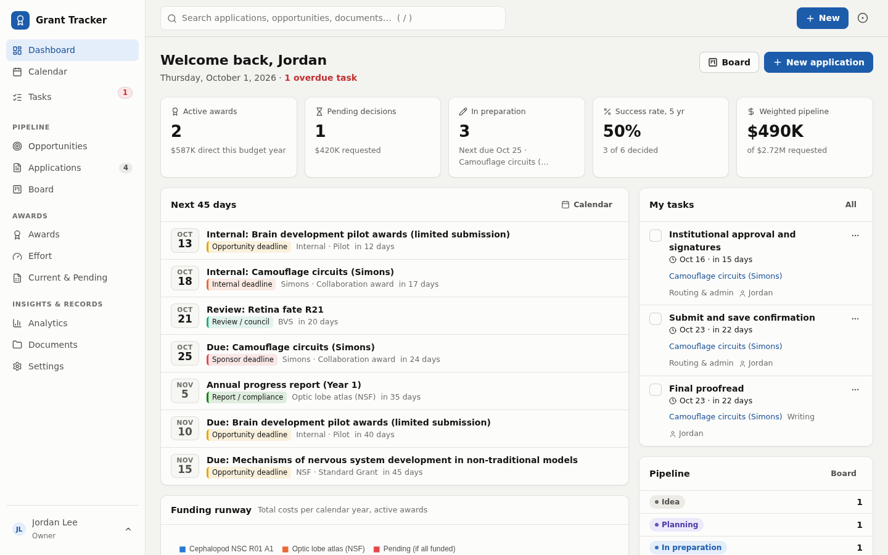
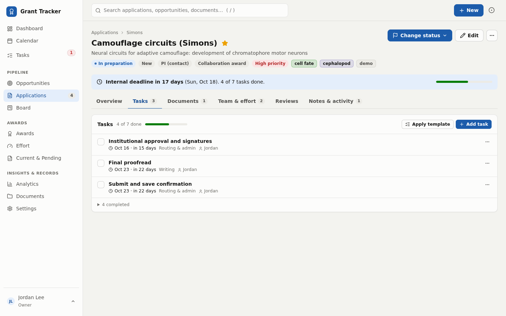
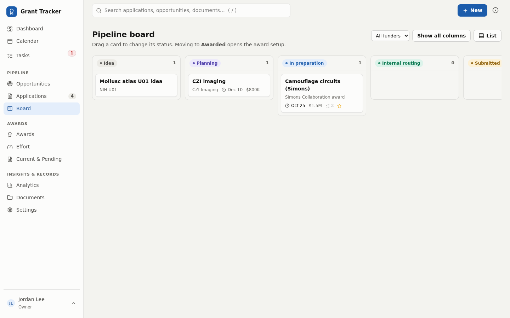
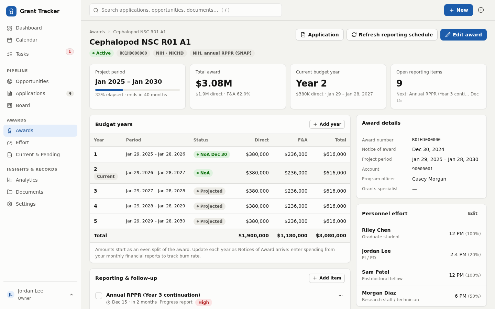
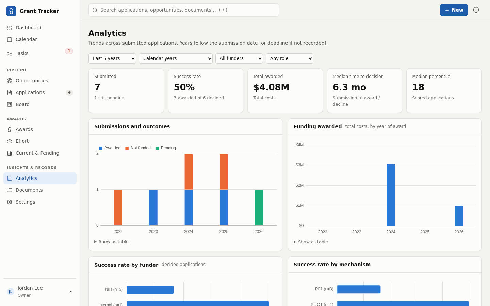
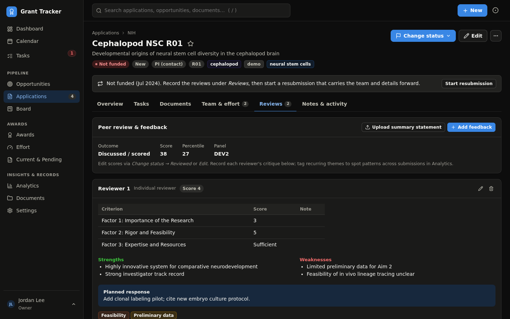
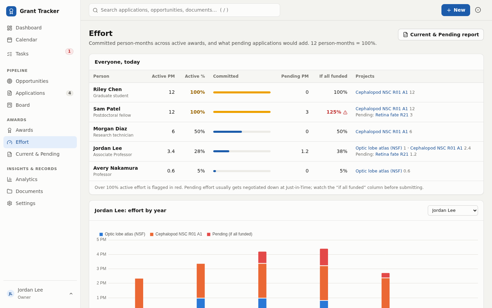

# Grant Tracker

A private, login-protected web portal for running a lab's grant portfolio: track opportunities, plan and submit applications, keep the documents and reviewer feedback for every submission, and manage awards after they are funded (budget years, effort, progress reports, close-out). Dashboards and analytics show deadlines, the funding runway and success rates over time.

It runs as a set of Docker containers. Every record, including uploaded documents, lives in one PostgreSQL database in its own data volume, so a single nightly `pg_dump` is a complete backup.



## Features

**Pipeline**
- **Opportunities**: RFAs, NOFOs and foundation calls with LOI, internal and sponsor deadlines, award ceilings, limited-submission flags and a 1 to 5 fit score. "Start application" copies the details over.
- **Applications** with a 12-step status workflow (Idea, Planning, In preparation, Internal routing, Submitted, Under review, Reviewed, Pending award, Awarded, Not funded, Withdrawn, Not pursued). Every change is logged with date, user and note.
- **Kanban board**: drag a card to change status. Dropping on *Awarded* opens award setup.
- Works for any funder or mechanism. Generic fields cover sponsor unit (NIH institute, NSF directorate), mechanism, review panel, score and percentile, plus free-form **custom fields** per application.
- **Resubmissions and renewals**: one click creates an A1 (or renewal) linked to its parent, carrying forward team, budget and abstract. The full A0, A1, renewal lineage is shown on each application.
- **Checklist templates** generate tasks back-scheduled from the deadline (weekend dates move to Friday). NIH research grant, NSF proposal and foundation templates are included and editable.

**Each application has tabs for**
- **Tasks**, with assignees, priorities and one-click completion.
- **Documents**: upload files (stored in the database) or link to Google Drive, OneDrive or Box. Mark the final submitted version, version labels, and owner-only restriction for sensitive files. Text inside PDFs and Word files is indexed for search, so past Specific Aims and boilerplate are easy to find.
- **Team and effort**: personnel with role and person-months (enter either person-months or % effort; the other updates).
- **Reviews**: the score, percentile and outcome, then one card per reviewer with criterion scores (NIH simplified framework, classic criteria or NSF merit criteria suggested), strengths, weaknesses, your planned response and **critique themes** that roll up across submissions.
- **Notes and activity**: team notes (Markdown) and an activity timeline, plus field-level change history.

**After the award**
- Award record with award number, project period, no-cost extension, account number and grants specialist.
- **Budget years** created automatically and editable as each Notice of Award arrives, with optional spent-to-date for a burn bar.
- **Reporting schedule** generated from the dates: NIH SNAP annual RPPRs (15th of the month before the budget year ends), multi-year funded RPPRs, and final RPPR, FFR and Final Invention Statement at 120 days; or annual plus final reports for other funders. Regeneration never touches completed tasks.
- An **award setup checklist** runs automatically: review NoA terms, confirm account, effort allocations, subawards, kick-off, data repositories, then renewal planning at 18 months and an NCE decision at 4 months before the end.
- **Effort dashboard**: committed person-months per person today, what pending applications would add, over-commitment warnings and a per-person effort-by-year chart.
- **Current and Pending (Other Support)** report per person in NIH field order, exportable to **Word**, CSV or print.

**Overview and insight**
- Dashboard: active awards, pending decisions, success rate, weighted pipeline (requested amount times your estimated chance), next 45 days, your tasks, awards ending within a year and a funding runway chart.
- Calendar month view and a private **iCalendar feed** to subscribe from Google Calendar or Outlook.
- Analytics: submissions and outcomes by year, success rate by funder and mechanism, funding awarded per year, the funding runway, score versus outcome, time to decision, monthly workload and recurring critique themes. Calendar or fiscal years. Every chart has a table view.
- Global search (press `/`) across applications, opportunities, tasks, people and document contents.
- CSV import for your submission history and CSV export of any filtered list.
- Email digest (weekly look-ahead plus a daily "due in 2 days" note) and optional Slack webhook.
- Light and dark themes; works on a phone.

**Security**
- Login required for every page. Roles: **Owner** (manages users), **Editor** (changes data), **Viewer** (read-only).
- Optional or mandatory **two-factor authentication** (any TOTP app) with one-time backup codes.
- Brute-force lockout, strict security headers (CSP, HSTS, no framing), HTTPS via Caddy, authenticated document downloads, owner-only documents, and a full audit history.

| | |
|---|---|
|  |  |
|  |  |
|  |  |

## Quick start

Requires Docker with Compose v2.

```bash
git clone <this repo> grant_tracker && cd grant_tracker
cp .env.example .env
```

Edit `.env` and set at least:

```ini
DJANGO_SECRET_KEY=   # python3 -c "import secrets; print(secrets.token_urlsafe(50))"
POSTGRES_PASSWORD=   # any long random string
GT_OWNER_USERNAME=admin
GT_OWNER_PASSWORD=   # first sign-in password; change it afterwards
```

Then:

```bash
docker compose up -d --build
```

Open <https://localhost> (your browser will warn about Caddy's local certificate on `localhost`). Sign in, then:

1. **Profile and security**: change your password, turn on two-factor authentication, copy the calendar feed URL into Google Calendar (*Other calendars, From URL*).
2. **Settings, People**: add yourself and link your login, so Effort and Current and Pending default to you.
3. Add an opportunity or application, or **import your history** from CSV (*New, Import from CSV*; a template is provided).

To explore with fictional demo data first:

```bash
docker compose exec web python manage.py seed_demo
docker compose exec web python manage.py seed_demo --remove   # when done
```

## Deploying for real

The same compose file runs on a lab server, a university VM or a cloud host.

1. Point a DNS name at the machine, for example `grants.yourlab.org`, with ports 80 and 443 open.
2. In `.env` set `SITE_ADDRESS`, `SITE_URL`, `DJANGO_ALLOWED_HOSTS` and `DJANGO_CSRF_TRUSTED_ORIGINS` to that name. Caddy obtains and renews a Let's Encrypt certificate automatically.
3. To use an institutional certificate instead, mount it into the `caddy` service and set `CADDY_TLS=tls /certs/fullchain.pem /certs/privkey.pem`.
4. Set `EMAIL_HOST` and related settings to enable digests and password reset.
5. Consider `REQUIRE_2FA=1` once everyone has enrolled.

Containers:

| Service | Role |
|---|---|
| `db` | PostgreSQL 16; data in the `pgdata` volume; not exposed outside Docker |
| `web` | Django app (gunicorn) |
| `caddy` | HTTPS reverse proxy |
| `scheduler` | Sends the email/Slack digests |
| `backup` | Nightly `pg_dump` to `./backups` with 30-day rotation |

Check your institution's data policies before storing anything sensitive. This tool is meant for grant administration records, not protected health information.

## Backups and restore

Backups run nightly at `BACKUP_HOUR` into `BACKUP_DIR` (default `./backups`). Copy that folder somewhere off the machine, such as institutional storage.

```bash
docker compose exec backup /backup.sh now                          # back up immediately

# Restore a dump (replaces current data)
docker compose stop web scheduler
docker compose exec -T db pg_restore -U grant_tracker -d grant_tracker --clean --if-exists < backups/grant_tracker-YYYYMMDD-HHMMSS.dump
docker compose start web scheduler
```

## Updating

```bash
git pull
docker compose up -d --build     # migrations run automatically on start
```

## Development

```bash
python3 -m venv .venv && . .venv/bin/activate
pip install -r requirements.txt
# needs a local PostgreSQL; see .env.example for the POSTGRES_* variables
export DJANGO_DEBUG=1 DJANGO_SECURE_HTTPS=0 POSTGRES_PASSWORD=... POSTGRES_HOST=localhost
python manage.py migrate
python manage.py createsuperuser
python manage.py seed_demo
python manage.py runserver
python manage.py test
```

Stack: Django 5.2 LTS, PostgreSQL 16, HTMX 2 and Alpine.js for in-place updates, SortableJS for the board, Chart.js for charts. Front-end libraries are vendored in `static/vendor`; there is no JavaScript build step. The CSS design system is plain CSS in `static/css/app.css`.

Code map:

| Path | Contents |
|---|---|
| `grants/models.py` | Data model: Funder, Opportunity, Application, Award, BudgetPeriod, Personnel, Task, Document (+ DocumentBlob), ReviewFeedback, ChecklistTemplate, Activity |
| `grants/services.py` | Status workflow, checklists, budget years, reporting schedule, resubmission cloning, document storage and text extraction |
| `grants/effort.py`, `grants/analytics.py` | Effort and analytics calculations |
| `grants/views/` | One module per area |
| `accounts/` | User model, roles, 2FA, user management |
| `docker/` | Entrypoint, Caddyfile, backup script |

## Notes on generated dates

NIH reporting dates follow the standard rules for SNAP and multi-year funded awards and the 120-day close-out window. Always confirm against your Notice of Award and eRA Commons; edit any generated task if your award differs.

## Possible next steps

- Pull awards and scores automatically from NIH RePORTER by award number.
- Watch Grants.gov or NIH Guide feeds for new opportunities matching saved keywords.
- Sign in with your institution's SSO (SAML/Shibboleth) instead of local passwords.
- Two-way sync with Google Calendar instead of a read-only feed.
- Spending import from your institution's monthly financial reports for burn-rate tracking.
